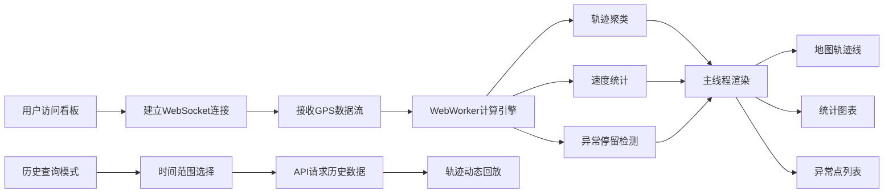

## 1. 产品概述
实时轨迹看板系统，用于可视化监控大量移动目标（出租车/船只）的实时位置与动态轨迹，提供数据分析与异常检测能力。
- 面向运营调度人员、数据分析人员，提供实时态势感知、历史轨迹回溯、异常行为预警等功能
- 核心价值：高并发数据流处理能力、WebWorker计算架构保障渲染流畅、丰富的统计可视化帮助决策

## 2. 核心功能

### 2.1 功能模块
1. **实时轨迹地图**：WebSocket接收GPS数据流，在地图上绘制动态轨迹线与实时位置标记
2. **统计分析面板**：速度分布直方图、热点区域热力图、异常停留点列表
3. **数据计算引擎**：WebWorker中执行轨迹聚类、异常停留检测、速度统计
4. **历史回放系统**：时间范围筛选、历史轨迹查询与动态回放

### 2.3 页面详情
| 页面名称 | 模块名称 | 功能描述 |
|-----------|-------------|---------------------|
| 主看板 | 顶部控制栏 | 实时/回放模式切换、目标筛选、时间范围选择器、数据流控制 |
| 主看板 | 地图视图 | Leaflet地图渲染、D3绘制SVG轨迹线、车辆/船只标记点、轨迹渐变色效果 |
| 主看板 | 统计面板(右) | 速度分布直方图(D3)、热点区域热力图(D3)、异常停留点列表 |
| 主看板 | 状态指示 | 连接状态、数据吞吐、在线目标数、FPS帧率显示 |

## 3. 核心流程
用户打开页面 → 建立WebSocket连接 → 接收实时GPS数据 → WebWorker异步计算(聚类/统计/异常检测) → 主线程渲染地图与图表 → 支持切换历史查询模式 → 按时间范围请求历史数据 → 动态回放轨迹

## 4. 用户界面设计

### 4.1 设计风格
- **主色调**：深空蓝背景 (#0a0e1a)，科技感青色高亮 (#00f5d4)，警示橙 (#ff6b35)
- **辅助色**：轨迹渐变色(蓝→青→黄→橙)、中性灰(#2a3042)
- **按钮样式**：扁平化直角、细边框、悬浮发光效果
- **字体**：主标题使用 Space Grotesk，正文使用 JetBrains Mono 等宽字体强化数据感
- **布局**：深色仪表盘风格，左侧大地图占75%，右侧统计面板占25%
- **视觉效果**：微发光边框、数据点脉冲动画、轨迹线渐隐效果

### 4.2 页面设计概览
| 页面名称 | 模块名称 | UI元素 |
|-----------|-------------|-------------|
| 主看板 | 控制栏 | 深色半透明背景、模式切换Tab、时间选择器、发光状态指示灯 |
| 主看板 | 地图视图 | 暗色地图底图、SVG轨迹线(渐变色)、车辆标记(脉冲动画)、轨迹尾迹渐隐 |
| 主看板 | 统计面板 | 卡片式布局、D3直方图(青色系)、热力图网格、异常点列表(橙色警示) |
| 主看板 | 状态栏 | 等宽字体数据展示、FPS实时显示、吞吐速率、连接状态脉冲灯 |

### 4.3 响应式
- 桌面端优先设计（1920×1080+）
- 右侧面板在窄屏下折叠为底部抽屉
- 触控设备支持手势缩放与拖动
