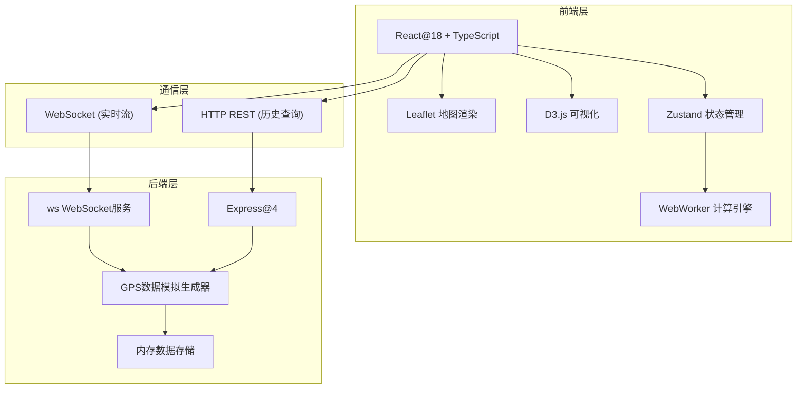
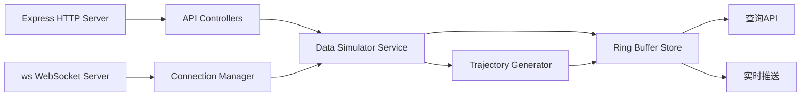
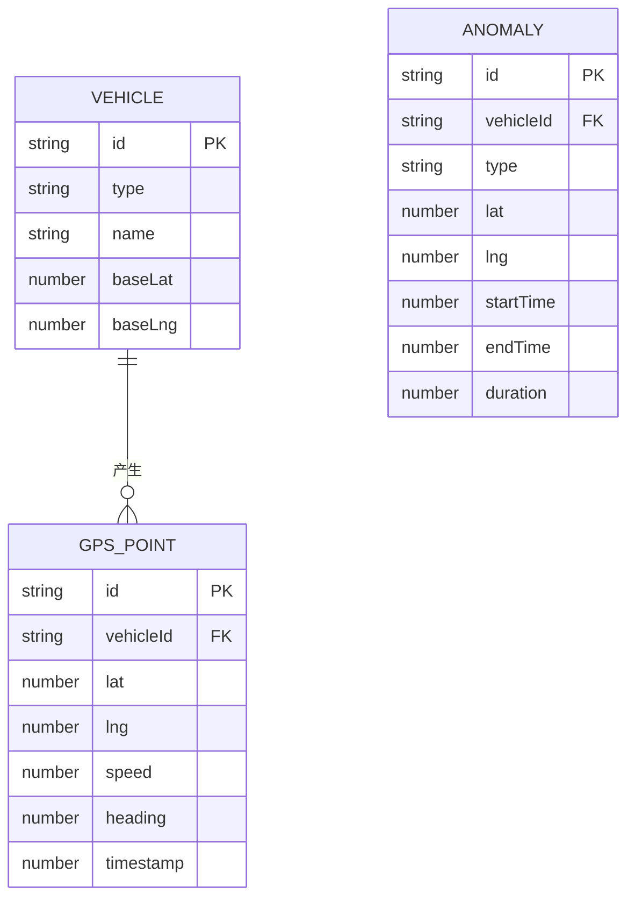

## 1. 架构设计



## 2. 技术说明
- **前端**：React@18 + TypeScript + Vite + TailwindCSS@3 + Zustand
- **地图**：Leaflet (开源无需API Key) + D3.js SVG叠加层
- **可视化**：D3.js v7 (直方图、热力图、轨迹线绘制)
- **计算**：Web Worker (DBSCAN聚类、停留点检测、统计聚合)
- **后端**：Express@4 + ws (WebSocket库) + TypeScript
- **数据存储**：内存环形缓冲区（存储最近1小时轨迹数据）
- **初始化工具**：vite-init (react-express-ts模板)

## 3. 路由定义
| 路由 | 用途 |
|-------|---------|
| / | 实时轨迹看板主页面 |

## 4. API 定义

### 4.1 WebSocket消息格式
```typescript
interface GPSPoint {
  id: string;
  vehicleId: string;
  type: 'taxi' | 'ship';
  lat: number;
  lng: number;
  speed: number;
  heading: number;
  timestamp: number;
}

interface WSMessage {
  type: 'gps_batch' | 'status';
  data: GPSPoint[] | { connected: number; throughput: number };
}
```

### 4.2 REST API
```typescript
// GET /api/vehicles - 获取所有在线车辆
interface VehicleListResponse {
  vehicles: Array<{
    id: string;
    type: 'taxi' | 'ship';
    lastLat: number;
    lastLng: number;
    lastSpeed: number;
    lastUpdate: number;
  }>;
}

// GET /api/history - 获取历史轨迹
interface HistoryRequest {
  vehicleId: string;
  startTime: number;
  endTime: number;
}
interface HistoryResponse {
  points: GPSPoint[];
}

// GET /api/playback - 回放控制
// GET /api/vehicles/:id/trail - 获取单车最近轨迹
```

## 5. 服务端架构图



## 6. 数据模型

### 6.1 数据模型定义



### 6.2 WebWorker消息协议
```typescript
// 主线程 -> Worker
type WorkerInMessage =
  | { type: 'ADD_POINTS'; points: GPSPoint[] }
  | { type: 'GET_STATS' }
  | { type: 'RESET' };

// Worker -> 主线程
type WorkerOutMessage =
  | { type: 'STATS_UPDATE'; data: StatsData }
  | { type: 'CLUSTERS_UPDATE'; data: Cluster[] }
  | { type: 'ANOMALIES_UPDATE'; data: AnomalyPoint[] };

interface StatsData {
  speedHistogram: Array<{ bin: number; count: number }>;
  heatmapGrid: Array<{ x: number; y: number; intensity: number }>;
  totalPoints: number;
  activeVehicles: number;
}

interface Cluster {
  id: string;
  centerLat: number;
  centerLng: number;
  pointCount: number;
  vehicleIds: string[];
}

interface AnomalyPoint {
  id: string;
  vehicleId: string;
  lat: number;
  lng: number;
  startTime: number;
  endTime: number;
  durationMinutes: number;
  avgSpeed: number;
}
```
